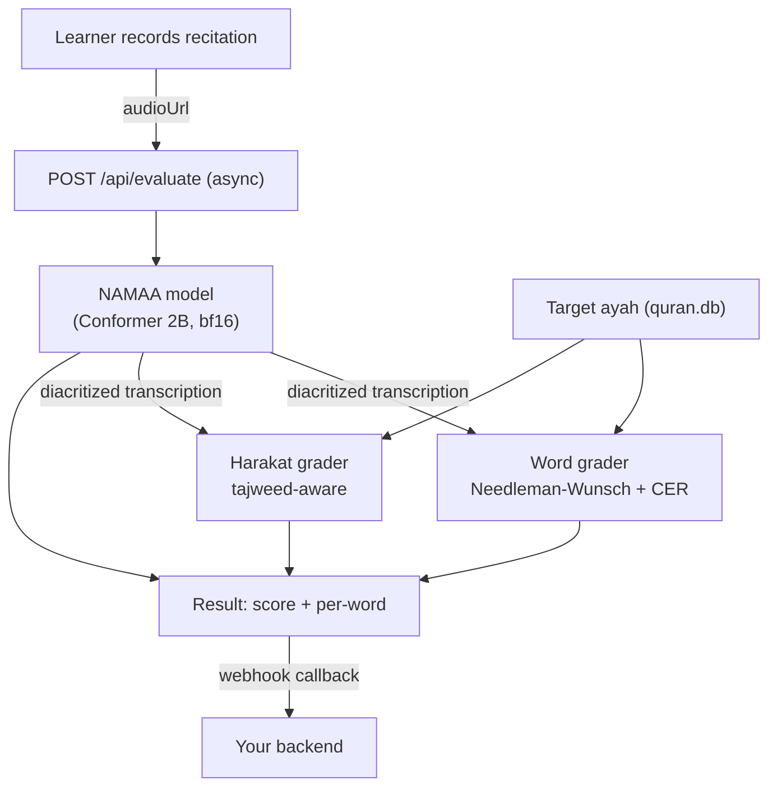

# 🎙️ Quran-ARS — Automatic Recitation Scoring


-green)


**An "automated sheikh": a learner records their Quran recitation, and the system grades it like a
teacher — checking both the *words* (memorization / hifz) and the *pronunciation* (tajweed /
harakat), and returning the learner's *actual* recitation written with diacritics.**

It runs on a **single model**, [`NAMAA-Space/Cohere-Speech-Tashkeel-2B`](https://huggingface.co/NAMAA-Space/Cohere-Speech-Tashkeel-2B),
which transcribes the recitation **with acoustically-derived tashkeel** — i.e. it writes the vowel
the reciter *actually produced* (including mistakes), which is what makes tajweed grading possible.

---

## ✨ What it does

| | |
|---|---|
| **📖 Memorization (words)** | Which words were correct / wrong / skipped / extra, vs. the target ayah. |
| **🎼 Tajweed (harakat)** | Whether the short vowels were pronounced correctly (e.g. said *fatha* where a *damma* is required), with tajweed-aware tolerances (waqf, shadda, implicit sukun). |
| **🔤 Diacritized recitation** | The learner's **actual** recitation written with tashkeel — their real words, not the "correct answer". |
| **🗣️ Spoken feedback** | Arabic TTS feedback + a reference reciter's audio when the learner fails. |
| **📱 Async API** | `POST /api/evaluate` returns instantly with a `jobId`; the full result is delivered to your **webhook**. Built for mobile backends. |

**Measured quality:** word accuracy **0.98** (clean) / **0.93** (phone-noise) / **0.88** (kids);
harakat **false-rejection ~0–1.4%** (safe on scripture, even noisy); diacritic error rate ~6.6%.

---

## 🏗️ How it works



One model, one pass → words + harakat + the diacritized recitation. The canonical text comes from
a bundled Quran database; the target ayah range is provided per request.

---

## 📁 Repository layout

```text
Quran-ARS/
├── delivery/                       # ⭐ THE DEPLOYABLE SERVICE (hand this to the backend)
│   ├── main.py                     #   FastAPI app: /api/evaluate (async) + /grade_recitation + /health
│   ├── core/
│   │   ├── namaa_model.py          #   the single ASR model wrapper
│   │   ├── grader.py               #   word/memorization grading
│   │   ├── harakat_grader.py       #   tajweed/harakat grading (tolerances)
│   │   ├── segmenter.py · tts.py · quran_db.py
│   ├── data/quran.db               #   canonical (diacritized) Quran
│   ├── Dockerfile · docker-compose.yml · requirements.txt
│   ├── test_client.py              #   sync + async(/api/evaluate + webhook) test harness
│   ├── Colab_Test.ipynb            #   FREE GPU end-to-end test (before buying a server)
│   ├── AGENT_DEPLOY_PROMPT.md      #   paste-to-your-agent deploy prompt (self-contained)
│   ├── BACKEND_HANDOFF.md          #   full API contract + acceptance checklist
│   ├── BACKEND_GUIDE_AR.md         #   دليل الباك-اند بالعربية (اختبار + ربط)
│   └── DEPLOYMENT_GUIDE.md         #   cloud / Nginx / systemd
├── docs/                           # Learning + reference material
│   ├── Quran-ARS-Learning-Guide.md         # ground-up tour of the whole system
│   ├── Quran-ARS-Technical-Documentation.md# exhaustive record + experiment log
│   ├── Deployment-and-Cost.md              # 💰 servers + pricing (for the client)
│   └── deep-dive/                          # 8-chapter Speech-AI textbook + runnable code
├── finetuning/                     # research + validation scripts (the R&D journey)
└── data/                           # datasets & caches (gitignored — not in the repo)
```

---

## 🚀 Quick start

### Option A — test it FREE on a GPU first (recommended)
Open **[`delivery/Colab_Test.ipynb`](delivery/Colab_Test.ipynb)** in Google Colab →
*Runtime → GPU* → *Run all*. It loads the model, gives you a public URL, and runs the full
sync + async(webhook) tests. See **[docs/Deployment-and-Cost.md](docs/Deployment-and-Cost.md)** for
free-GPU options.

### Option B — deploy the service (Docker, GPU host)
```bash
cd delivery
printf 'AI_API_KEY=%s\nPUBLIC_BASE_URL=%s\n' "<STRONG_SECRET>" "https://ai.example.com" > .env
docker compose up -d --build          # first build bakes the ~5 GB model into the image
curl http://localhost:8000/health     # -> {"status":"ok","model_loaded":true}
```
Full, self-contained instructions: **[delivery/AGENT_DEPLOY_PROMPT.md](delivery/AGENT_DEPLOY_PROMPT.md)**.

---

## 🔌 The API (for the backend)

`POST /api/evaluate` (header `Authorization: Bearer <AI_API_KEY>`) with `audioUrl`, `surahNumber`,
`fromAyah`, `toAyah`, `webhookUrl`, `webhookSecret`, … → returns `{ "status":"processing", "jobId" }`
immediately, then **POSTs the result to your `webhookUrl`** (score, `userRecitationDiacritized`,
`harakatErrors`, per-word detail). The **only value that must match** on both sides is `AI_API_KEY`.

Contracts & guides: **[BACKEND_HANDOFF.md](delivery/BACKEND_HANDOFF.md)** (EN) ·
**[BACKEND_GUIDE_AR.md](delivery/BACKEND_GUIDE_AR.md)** (بالعربية).

---

## 💻 Requirements

- A **CUDA GPU** (the model is 2B; ~5–6 GB VRAM in **bf16**). NVIDIA **T4 / L4 / A10G** are plenty.
- CUDA 12.x host, `transformers>=5.4`, torch cu12x. **bf16 is required** (fp16 produces garbage).
- Servers & cost: **[docs/Deployment-and-Cost.md](docs/Deployment-and-Cost.md)**.

---

## 📚 Learn how it works

- **[Learning Guide](docs/Quran-ARS-Learning-Guide.md)** — a ground-up tour (audio → ML → data →
  models → grading → lessons).
- **[Deep-Dive series](docs/deep-dive/)** — an 8-chapter Speech-AI textbook (DSP, attention, CTC,
  seq2seq, self-supervised + LoRA, evaluation, phonetics, pronunciation assessment) + runnable
  `from_scratch.py`.
- **[Technical Documentation](docs/Quran-ARS-Technical-Documentation.md)** — the exhaustive record
  and full experiment log.

---

## 📄 License

Code: for the Quran-Yutla project. Model: `NAMAA-Space/Cohere-Speech-Tashkeel-2B` is **Apache-2.0**
(self-hostable, no per-request fees). Feedback TTS via `edge-tts`; reference recitations via
everyayah.com.
