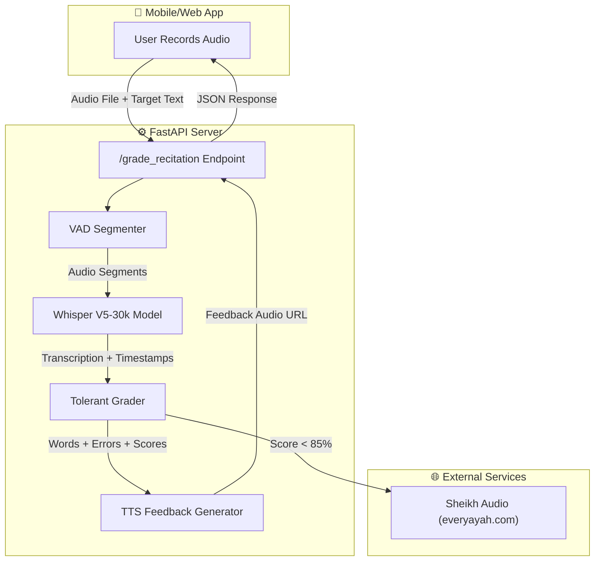
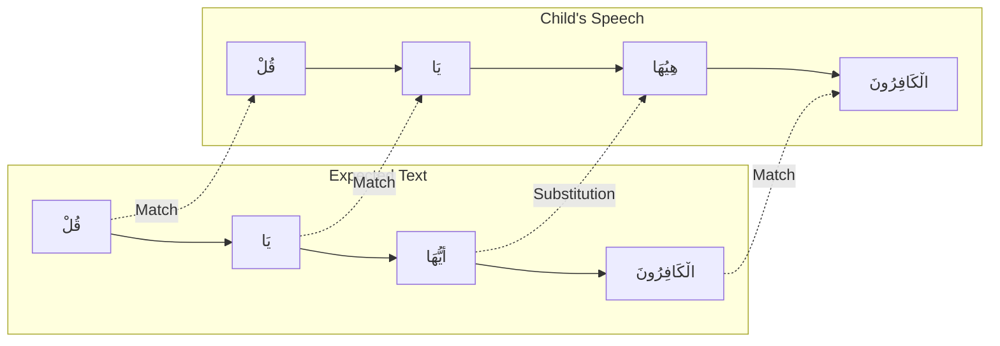

# 🎙️ Quran ASR for Kids


**An advanced AI system designed to listen, transcribe, and grade children's recitation of the Holy Quran.**

Unlike standard ASR models that fail on child speech (mumbling, incorrect tajweed, stuttering), this system is fine-tuned specifically for children's voices and includes a **Tolerant Grading** layer that focuses on phonetic intent rather than perfect spelling.

---

## 🚀 Key Features

| Feature | Description |
| :--- | :--- |
| **👶 Child-Centric ASR** | Fine-tuned Whisper model (V5-30k) trained on "Minshawi with Child Repeat" dataset. |
| **🧠 Tolerant Grader** | Custom grading engine using Phonetic Normalization + Fuzzy Alignment. |
| **🔤 Character-Level Errors** | Detects: حذف حرف / زيادة حرف / استبدال حرف / تغيير حركة. |
| **📊 Per-Word Scoring** | Individual accuracy score for each word (0.0 to 1.0). |
| **⏱️ Word Timestamps** | Start/end timestamps for every word spoken. |
| **🗣️ Speaking Teacher** | TTS feedback in Arabic - praises correct recitation and verbally corrects mistakes. |
| **🔇 Smart Silence Detection** | VAD (Voice Activity Detection) handles long recordings by splitting on breath pauses. |
| **📱 Production API** | FastAPI backend returns JSON feedback ready for mobile integration. |

---

## 🏗️ System Architecture



---

## 📁 Project Structure

```
Quran-ARS/
├── backend/                  # Core API Server
│   ├── core/                 # Core Processing Modules
│   │   ├── grader.py         # Tolerant Grading Engine (Needleman-Wunsch + Fuzzy + Char-Level Errors)
│   │   ├── model_loader.py   # Whisper Model Wrapper (ASR + Word Timestamps)
│   │   ├── segmenter.py      # VAD Audio Segmenter (Silence Detection + Merging)
│   │   └── tts.py            # Text-to-Speech Feedback (Arabic, edge-tts)
│   ├── main.py               # FastAPI Server Entry Point (API Endpoints)
│   ├── test_client.py        # Demo Client (Pretty-prints full analysis)
│   ├── test_flywheel.py      # Data Flywheel Test
│   └── generate_report.py    # Arabic Report Generator
│
├── src/                      # Source Library
│   ├── quran_db/             # Quran Database Module
│   │   ├── core.py           # QuranDB class (SQLite queries for Ayah text)
│   │   └── importer.py       # SQL-to-SQLite importer (hafsData_v2-0.sql → quran.db)
│   └── utils/
│       └── audio.py          # Audio Preprocessing (16kHz mono conversion)
│
├── finetuning/               # Model Training Pipeline
│   ├── finetune.py           # Main LoRA Fine-Tuning Script (Whisper + LoRA)
│   ├── dataset_gen.py        # Dataset Generator (everyayah.com + kids data)
│   ├── evaluate.py           # Model Benchmarking (Base vs LoRA vs V5)
│   ├── quran_grader.py       # Standalone Grader (for training evaluation)
│   └── test_samples/         # Audio samples for testing
│
├── data/                     # Data Directory
│   ├── quran.db              # SQLite Quran Database
│   └── golden_negatives/     # User-reported error cases for retraining
│
├── tests/                    # Unit Tests
│   ├── test_asr.py           # ASR Transcription Tests (mocked)
│   ├── test_audio.py         # Audio Preprocessing Tests
│   └── test_quran_db.py      # Quran Database Tests
│
├── scripts/                  # Helper Scripts
│   └── verify_progress.py    # End-to-End Integration Verification
│
├── reports/                  # Demo Reports (Arabic)
├── docs/                     # Planning & Benchmark Documents
├── learning/                 # Study materials: Learning Guide, deep-dive series, tech docs
├── requirements.txt          # Python Dependencies (with versions)
└── README.md                 # This File
```

---

## 📊 Grading Algorithm

The grading system uses a **3-step process** to compare the child's recitation against the expected Quranic text:

### Step 1: Phonetic Normalization

Arabic text is normalized to handle spelling variations:

```
Input:  "بِسْمِ ٱللَّهِ ٱلرَّحْمَٰنِ"
Output: "بسم الله الرحمن"
```

- Remove diacritics (tashkeel).
- Unify Alef variants (أ, إ, آ → ا).
- Normalize Ta Marbuta (ة → ه).

### Step 2: Needleman-Wunsch Alignment

Words are aligned using dynamic programming (like DNA sequence alignment):



### Step 3: Fuzzy Matching

Words with minor pronunciation differences are accepted:

| Spoken | Expected | Distance | Result |
| :--- | :--- | :---: | :---: |
| "هِيُهَا" | "أَيُّهَا" | 0.35 | ✅ Match (threshold: 0.45) |
| "التفاح" | "والتين" | 0.80 | ❌ Error |

### Step 4: Character-Level Error Analysis

For each incorrect word, the system analyzes errors at the **character level**:

| Error Type | Arabic | Description |
| :--- | :--- | :--- |
| `char_substitution` | استبدال_حرف | A letter was replaced with another |
| `char_deletion` | حذف_حرف | A letter was missed/skipped |
| `char_insertion` | زيادة_حرف | An extra letter was added |
| `diacritic_change` | تغيير_حركة | The tashkeel/haraka is different |

---

## 🚀 Quick Start

### Prerequisites

- **Python** 3.9+
- **CUDA-enabled GPU** (Recommended for inference speed)
- **FFmpeg** (Required by librosa for audio processing)
- **Model Checkpoint**: `finetuning/checkpoints_v5/checkpoint-30000` (the fine-tuned Whisper model)
- **Quran Database**: `data/quran.db` (SQLite database with all Ayah texts)

### Step-by-Step Installation

```bash
# 1. Clone the repository
git clone https://github.com/HassanAbdelshafy21/Quran-ARS.git
cd Quran-ARS

# 2. Create a virtual environment (recommended)
python -m venv venv
source venv/bin/activate  # Linux/Mac
# OR
venv\Scripts\activate     # Windows

# 3. Install PyTorch with CUDA support
pip install torch torchvision torchaudio --index-url https://download.pytorch.org/whl/cu118

# 4. Install all other dependencies
pip install -r requirements.txt

# 5. Verify the Quran database exists
#    If data/quran.db doesn't exist, generate it:
python -c "from src.quran_db.importer import import_quran_sql_to_sqlite; import_quran_sql_to_sqlite('data/quran/hafsData_v2-0.sql', 'data/quran.db')"

# 6. Verify the model checkpoint exists
#    Ensure finetuning/checkpoints_v5/checkpoint-30000/ directory contains the model files
```

### Run the Server

```bash
python backend/main.py
```

The server will start at `http://localhost:8000`.

**Auto-generated API docs**: `http://localhost:8000/docs` (Swagger UI)

### Run the Demo

```bash
python backend/test_client.py
```

This sends a test audio file, grades it, and pretty-prints the full analysis.

---

## 📡 API Reference

### `POST /grade_recitation`

Grade a child's Quran recitation.

**Request (Multipart Form):**

| Field | Type | Required | Description |
| :--- | :--- | :---: | :--- |
| `file` | File | ✅ | Audio file (MP3, WAV, OGG, M4A) |
| `target_ayah` | String | ✅ | Expected Quranic text |
| `surah_num` | Integer | ❌ | Surah number (1-114) — enables Sheikh reference audio |
| `ayah_num` | Integer | ❌ | Specific Ayah number — uses single ayah reference |

**Example Request (cURL):**

```bash
curl -X POST http://localhost:8000/grade_recitation \
  -F "file=@recording.ogg" \
  -F "target_ayah=بِسْمِ ٱللَّهِ ٱلرَّحْمَٰنِ ٱلرَّحِيمِ" \
  -F "surah_num=1" \
  -F "ayah_num=1"
```

**Example Request (Python):**

```python
import requests

response = requests.post(
    "http://localhost:8000/grade_recitation",
    files={"file": open("recording.ogg", "rb")},
    data={
        "target_ayah": "بِسْمِ ٱللَّهِ ٱلرَّحْمَٰنِ ٱلرَّحِيمِ",
        "surah_num": 1,
        "ayah_num": 1
    }
)
print(response.json())
```

**Response (JSON):**

```json
{
  "request_id": "5dd616b3-1a1a-4d7c-8536-d266054eb2e4",
  "status": "success",
  "user_recitation": "بسم الله الرحمن الرحيم",
  "expected_recitation": "بِسْمِ ٱللَّهِ ٱلرَّحْمَٰنِ ٱلرَّحِيمِ",
  "passed": true,
  "accuracy": 1.0,
  "raw_score": "4/4",
  "mistakes": [],
  "words": [
    {
      "word": "بسم",
      "expected": "بسم",
      "is_correct": true,
      "score": 1.0,
      "error_type": null,
      "error_type_ar": null,
      "char_errors": [],
      "timestamp_start": 0.50,
      "timestamp_end": 0.92
    },
    {
      "word": "الله",
      "expected": "الله",
      "is_correct": true,
      "score": 1.0,
      "error_type": null,
      "error_type_ar": null,
      "char_errors": [],
      "timestamp_start": 0.92,
      "timestamp_end": 1.34
    },
    {
      "word": "الرحمن",
      "expected": "الرحمن",
      "is_correct": true,
      "score": 1.0,
      "error_type": null,
      "error_type_ar": null,
      "char_errors": [],
      "timestamp_start": 1.34,
      "timestamp_end": 1.80
    },
    {
      "word": "الرحيم",
      "expected": "الرحيم",
      "is_correct": true,
      "score": 1.0,
      "error_type": null,
      "error_type_ar": null,
      "char_errors": [],
      "timestamp_start": 1.80,
      "timestamp_end": 2.30
    }
  ],
  "feedback_audio": "http://localhost:8000/audio/feedback_5dd616b3.mp3",
  "reference_audio": null,
  "segments_processed": 1
}
```

**Example Response with Errors:**

```json
{
  "request_id": "a1b2c3d4-...",
  "status": "success",
  "user_recitation": "بسم اللا الرحمن",
  "expected_recitation": "بِسْمِ ٱللَّهِ ٱلرَّحْمَٰنِ ٱلرَّحِيمِ",
  "passed": false,
  "accuracy": 0.75,
  "raw_score": "3/4",
  "mistakes": [
    "خطأ: قلت 'اللا' بدلاً من 'الله'",
    "كلمة ناقصة: 'الرحيم'"
  ],
  "words": [
    {
      "word": "بسم",
      "expected": "بسم",
      "is_correct": true,
      "score": 1.0,
      "error_type": null,
      "error_type_ar": null,
      "char_errors": [],
      "timestamp_start": 0.50,
      "timestamp_end": 0.90
    },
    {
      "word": "اللا",
      "expected": "الله",
      "is_correct": false,
      "score": 0.667,
      "error_type": "substitution",
      "error_type_ar": "استبدال",
      "char_errors": [
        {
          "type": "استبدال_حرف",
          "type_en": "char_substitution",
          "position": 3,
          "got": "ا",
          "expected": "ه"
        }
      ],
      "timestamp_start": 0.90,
      "timestamp_end": 1.40
    },
    {
      "word": "الرحمن",
      "expected": "الرحمن",
      "is_correct": true,
      "score": 1.0,
      "error_type": null,
      "error_type_ar": null,
      "char_errors": [],
      "timestamp_start": 1.40,
      "timestamp_end": 2.00
    },
    {
      "word": null,
      "expected": "الرحيم",
      "is_correct": false,
      "score": 0.0,
      "error_type": "deletion",
      "error_type_ar": "حذف",
      "char_errors": [],
      "timestamp_start": null,
      "timestamp_end": null
    }
  ],
  "feedback_audio": "http://localhost:8000/audio/feedback_a1b2c3d4.mp3",
  "reference_audio": "https://everyayah.com/data/Minshawy_Mujawwad_192kbps/001001.mp3",
  "segments_processed": 1
}
```

**Response Fields:**

| Field | Type | Description |
| :--- | :--- | :--- |
| `request_id` | String | Unique ID for this request |
| `status` | String | `"success"` or error |
| `user_recitation` | String | What the AI heard (full transcription) |
| `expected_recitation` | String | The correct Quranic text |
| `passed` | Boolean | `true` if accuracy > 85% |
| `accuracy` | Float | Overall accuracy (0.0 to 1.0) |
| `raw_score` | String | Score as fraction (e.g., "3/4") |
| `mistakes` | Array[String] | Human-readable mistake descriptions (Arabic) |
| `words` | Array[Object] | Per-word analysis (see below) |
| `feedback_audio` | String | URL to TTS feedback audio (MP3) |
| `reference_audio` | String/null | URL to Sheikh recitation (null if passed) |
| `segments_processed` | Integer | Number of audio segments processed |

**`words` Array Object:**

| Field | Type | Description |
| :--- | :--- | :--- |
| `word` | String/null | What the child said (null if word was deleted/missed) |
| `expected` | String/null | Correct word (null if word was inserted/extra) |
| `is_correct` | Boolean | Whether word matched correctly |
| `score` | Float | Word similarity (0.0 to 1.0) |
| `error_type` | String/null | `"substitution"`, `"deletion"`, `"insertion"`, or null |
| `error_type_ar` | String/null | Arabic error type: `"استبدال"`, `"حذف"`, `"زيادة"` |
| `char_errors` | Array[Object] | Character-level error details |
| `timestamp_start` | Float/null | Word start time in seconds |
| `timestamp_end` | Float/null | Word end time in seconds |

**`char_errors` Array Object:**

| Field | Type | Description |
| :--- | :--- | :--- |
| `type` | String | `"استبدال_حرف"`, `"حذف_حرف"`, `"زيادة_حرف"`, `"تغيير_حركة"` |
| `type_en` | String | `"char_substitution"`, `"char_deletion"`, `"char_insertion"`, `"diacritic_change"` |
| `position` | Integer | Character position in the word |
| `got` | String | What was spoken (for substitution/insertion) |
| `expected` | String | What was expected (for substitution/deletion) |

---

### `POST /report_issue`

Report a grading error (saves audio for future retraining).

**Request (JSON):**

```json
{
  "request_id": "5dd616b3-1a1a-4d7c-8536-d266054eb2e4",
  "user_comment": "The grading was incorrect"
}
```

**Response:**

```json
{
  "status": "success",
  "message": "Reported."
}
```

---

## 🔌 Backend Integration Guide

### Connecting from Your Mobile/Web App

1. **Start the API server** on your backend machine:
   ```bash
   python backend/main.py
   ```

2. **Send audio + text** from your frontend:
   ```
   POST http://YOUR_SERVER_IP:8000/grade_recitation
   Content-Type: multipart/form-data
   
   Fields:
     file: <audio_file>
     target_ayah: <expected_quranic_text>
     surah_num: <1-114>     (optional)
     ayah_num: <ayah_number> (optional)
   ```

3. **Parse the JSON response** to display:
   - `passed` / `accuracy` → Show pass/fail status
   - `words[]` → Highlight each word green/red in the UI
   - `words[].timestamp_start/end` → Sync highlighting with audio playback
   - `words[].char_errors[]` → Show detailed error tooltips
   - `feedback_audio` → Play the TTS feedback
   - `reference_audio` → Play the Sheikh's correct recitation

4. **If user disputes the grade**, call:
   ```
   POST http://YOUR_SERVER_IP:8000/report_issue
   ```

### Auto-Generated API Docs

FastAPI automatically generates interactive API documentation:
- **Swagger UI**: `http://YOUR_SERVER_IP:8000/docs`
- **ReDoc**: `http://YOUR_SERVER_IP:8000/redoc`

---

## 📊 Model Performance

| Model | Child Accuracy | Notes |
| :--- | :---: | :--- |
| Baseline Whisper | Low | Fails on mumbling. |
| Tarteel AI | Moderate | Closed-source. |
| **V5-30k (Ours)** | **~95%** | Trained on child speech. Open-source. |

---

## 🔧 Technology Stack

| Component | Technology |
| :--- | :--- |
| Language | Python 3.9+ |
| ASR Model | OpenAI Whisper (fine-tuned with LoRA) |
| Base Model | `tarteel-ai/whisper-base-ar-quran` |
| Training | LoRA (r=32, alpha=64) via HuggingFace PEFT |
| Grading | Needleman-Wunsch DP + Fuzzy CER Matching |
| TTS | edge-tts (Arabic, `ar-EG-SalmaNeural`) |
| API | FastAPI + Uvicorn |
| Database | SQLite (Quran text) |
| Audio | librosa + soundfile |

---

## 🔮 Roadmap

1. **Real-Time Mode:** WebSocket for word-by-word highlighting as the child speaks.
2. **Sequence Analyzer:** Detect skipped verses or out-of-order recitation.
3. **Edge Deployment:** ONNX/CoreML for offline use on mobile devices.

---

## 📜 License

This project is licensed under the MIT License.

---

## 🤝 Contributing

Contributions are welcome! Please open an issue or submit a pull request.

## 📧 Contact

**Hassan Abdelshafy** - [GitHub](https://github.com/HassanAbdelshafy21)
