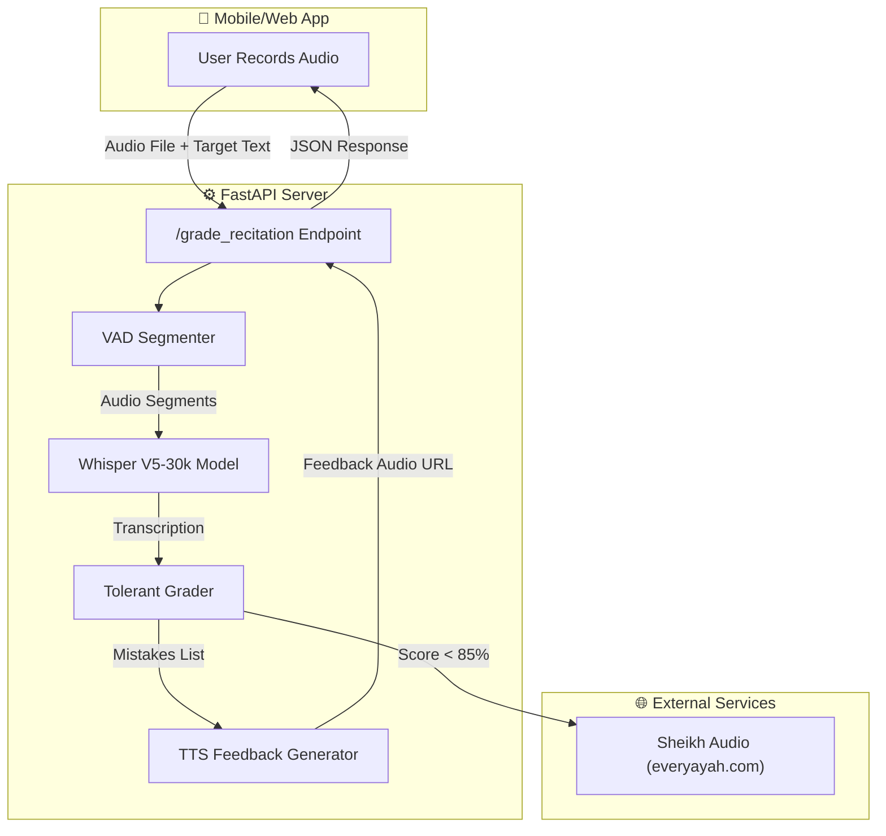
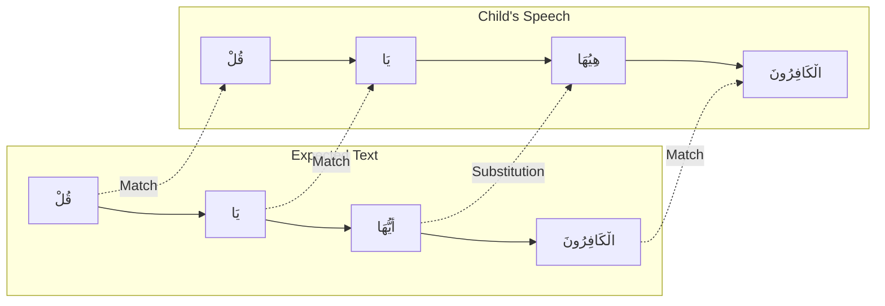

# 🎙️ Quran ASR for Kids


**An advanced AI system designed to listen, transcribe, and grade children's recitation of the Holy Quran.**

Unlike standard ASR models that fail on child speech (mumbling, incorrect tajweed, stuttering), this system is fine-tuned specifically for children's voices and includes a **Tolerant Grading** layer that focuses on phonetic intent rather than perfect spelling.

---

## 🚀 Key Features

| Feature | Description |
| :--- | :--- |
| **👶 Child-Centric ASR** | Fine-tuned Whisper model (V5-30k) trained on "Minshawi with Child Repeat" dataset. |
| **🧠 Tolerant Grader** | Custom grading engine using Phonetic Normalization + Fuzzy Alignment. |
| **🗣️ Speaking Teacher** | TTS feedback in Arabic - praises correct recitation and verbally corrects mistakes. |
| **🔇 Smart Silence Detection** | VAD (Voice Activity Detection) handles long recordings by splitting on breath pauses. |
| **📱 Production API** | FastAPI backend returns JSON feedback ready for mobile integration. |

---

## 🏗️ System Architecture



---

## 📊 Grading Algorithm

The grading system uses a **3-step process** to compare the child's recitation against the expected Quranic text:

### Step 1: Phonetic Normalization

Arabic text is normalized to handle spelling variations:

```
Input:  "بِسْمِ ٱللَّهِ ٱلرَّحْمَٰنِ"
Output: "بسم الله الرحمن"
```

- Remove diacritics (tashkeel).
- Unify Alef variants (أ, إ, آ → ا).
- Normalize Ta Marbuta (ة → ه).

### Step 2: Needleman-Wunsch Alignment

Words are aligned using dynamic programming (like DNA sequence alignment):



### Step 3: Fuzzy Matching

Words with minor pronunciation differences are accepted:

| Spoken | Expected | Distance | Result |
| :--- | :--- | :---: | :---: |
| "هِيُهَا" | "أَيُّهَا" | 0.35 | ✅ Match (threshold: 0.45) |
| "التفاح" | "والتين" | 0.80 | ❌ Error |

### Output

```json
{
  "passed": true,
  "accuracy": 0.95,
  "mistakes": [
    "خطأ: قلت 'هِيُهَا' بدلاً من 'أَيُّهَا'"
  ]
}
```

---

## 🚀 Quick Start

### Prerequisites

- Python 3.9+
- CUDA-enabled GPU (Recommended)
- FFmpeg

### Installation

```bash
# Clone the repository
git clone https://github.com/HassanAbdelshafy21/Quran-ARS.git
cd Quran-ARS

# Install dependencies
pip install -r requirements.txt
```

### Run the Server

```bash
python backend/main.py
```

The server will start at `http://localhost:8000`.

### Test with Sample Audio

```bash
python backend/test_client.py
```

---

## 📡 API Reference

### `POST /grade_recitation`

Grade a child's Quran recitation.

**Request (Multipart Form):**

| Field | Type | Description |
| :--- | :--- | :--- |
| `file` | File | Audio file (MP3, WAV, OGG, M4A) |
| `target_ayah` | String | Expected Quranic text |
| `surah_num` | Integer | Surah number (1-114) |
| `ayah_num` | Integer (Optional) | Specific Ayah number |

**Response (JSON):**

```json
{
  "request_id": "5dd616b3-1a1a-4d7c-8536-d266054eb2e4",
  "status": "success",
  "user_recitation": "سَبَّحَ لِلَّهِ مَا فِي السَّمَاوَاتِ...",
  "expected_recitation": "سَبَّحَ لِلَّهِ مَا فِي السَّمَاوَاتِ...",
  "passed": true,
  "accuracy": 1.0,
  "mistakes": [],
  "feedback_audio": "http://localhost:8000/audio/feedback_XXX.mp3",
  "reference_audio": null
}
```

**Note:** `reference_audio` is `null` when the child passes. It contains a Sheikh recitation URL when they need correction.

---

## 📁 Project Structure

```
Quran-ARS/
├── backend/              # Core API
│   ├── core/             # Model, Grader, TTS, VAD
│   ├── main.py           # FastAPI entry
│   └── test_client.py    # Demo client
├── docs/                 # Documentation
│   ├── planning/         # Historical proposals
│   └── benchmarks/       # Model comparison results
├── finetuning/           # Training scripts
│   ├── finetune.py       # Main training script
│   └── test_samples/     # Audio samples for testing
├── reports/              # Demo reports (Parent/Student)
├── scripts/              # Helper scripts
├── tests/                # Unit tests
└── requirements.txt
```

---

## 📊 Model Performance

| Model | Child Accuracy | Notes |
| :--- | :---: | :--- |
| Baseline Whisper | Low | Fails on mumbling. |
| Tarteel AI | Moderate | Closed-source. |
| **V5-30k (Ours)** | **~95%** | Trained on child speech. Open-source. |

---

## 🔮 Roadmap

1. **Real-Time Mode:** WebSocket for word-by-word highlighting as the child speaks.
2. **Sequence Analyzer:** Detect skipped verses or out-of-order recitation.
3. **Edge Deployment:** ONNX/CoreML for offline use on mobile devices.

---

## 📜 License

This project is licensed under the MIT License.

---

## 🤝 Contributing

Contributions are welcome! Please open an issue or submit a pull request.

## 📧 Contact

**Hassan Abdelshafy** - [GitHub](https://github.com/HassanAbdelshafy21)
